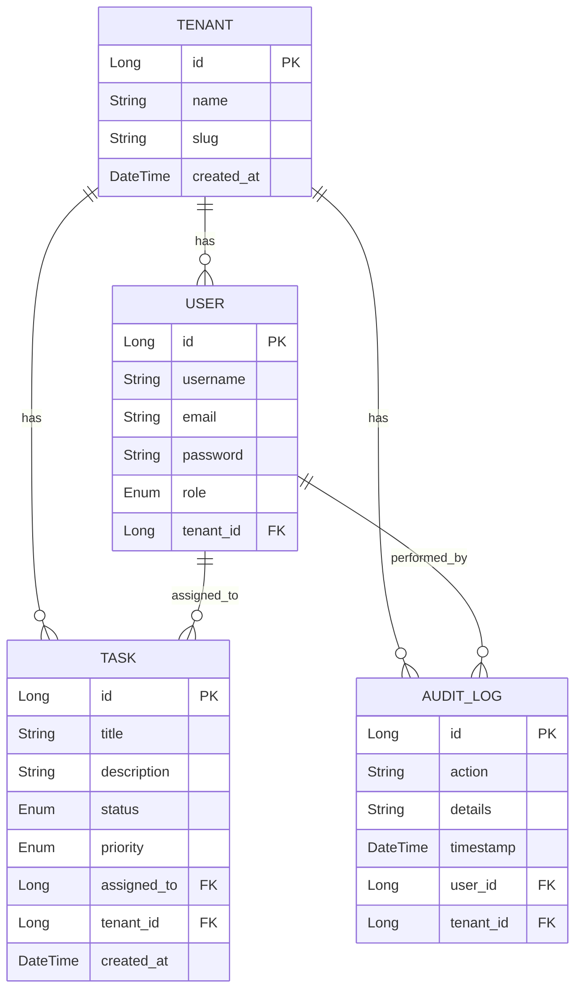

# Multi-Tenant Task Management System 🚀

A professional, enterprise-grade SaaS application built with **Spring Boot** and **React**. This system implements a **Multi-Tenant Architecture**, ensuring strict data isolation between different organizations (tenants).

---

## 🌟 Key Features

- **Multi-Tenancy**: Data isolation using a `tenant_id` discriminator. Each organization only sees its own users and tasks.
- **JWT Authentication**: Secure, stateless authentication with JSON Web Tokens.
- **Role-Based Access Control (RBAC)**:
  - `ADMIN`: Full control over the organization, users, and settings.
  - `MANAGER`: Can create and assign tasks.
  - `EMPLOYEE`: Can view and update their own tasks.
- **Task Management**: Full CRUD operations with priority and status tracking.
- **Audit Logging**: Every sensitive action is logged with timestamps and user details for compliance.
- **Modern Dashboard**: Real-time analytics and task overview.

---

## 🛠 Tech Stack

- **Frontend**: React.js, Vite, Tailwind CSS, Axios, Lucide Icons.
- **Backend**: Java 17, Spring Boot 3.x, Spring Security, Spring Data JPA.
- **Database**: MySQL 8.0.
- **Containerization**: Docker, Docker Compose.

---

## 🏗 Database Structure

The system uses a **Shared Database, Shared Schema** approach with a **Discriminator Column** (`tenant_id`) to ensure isolation.



---

## 🐳 Getting Started (Docker)

### Prerequisites
- [Docker Desktop](https://www.docker.com/products/docker-desktop/) installed and running.

### Installation Steps

1. **Clone the repository**:
   ```bash
   git clone https://github.com/your-username/your-repo-name.git
   cd your-repo-name
   ```

2. **Configure Environment Variables**:
   Copy the example environment file to create your own:
   ```bash
   cp .env.example .env
   ```

3. **Launch the Application**:
   Run the following command to build and start the entire stack:
   ```bash
   docker-compose up --build
   ```

4. **Access the App**:
   - **Frontend**: [http://localhost](http://localhost)
   - **Backend API**: [http://localhost:8080](http://localhost:8080)

---

## 📡 Key API Endpoints

| Method | Endpoint | Description | Access |
| :--- | :--- | :--- | :--- |
| `POST` | `/api/auth/register-tenant` | Register a new organization | Public |
| `POST` | `/api/auth/login` | Authenticate user & get JWT | Public |
| `GET` | `/api/tasks` | Get all tasks for the tenant | Authenticated |
| `POST` | `/api/tasks` | Create a new task | Admin/Manager |
| `GET` | `/api/users/me` | Get current user profile | Authenticated |
| `GET` | `/api/audit-logs` | View activity logs | Admin |

---

## 🔒 Security Implementation

- **JWT Filter**: Intercepts every request to validate the token and set the `TenantContext`.
- **TenantContext**: A ThreadLocal-based utility that stores the `tenant_id` for the duration of the request, ensuring JPA queries automatically filter data by tenant.
- **BCrypt**: Password hashing for secure storage.

---

## 📄 License

This project is licensed under the **MIT License**. Feel free to use, modify, and distribute it.

---

## 👨‍💻 Author
**Your Name**
- GitHub: [@your-username](https://github.com/your-username)
- LinkedIn: [Your Profile](https://linkedin.com/in/your-profile)
